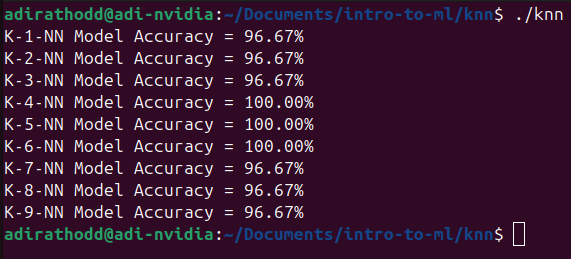

This project implements a K-Nearest Neighbors (KNN) classifier from scratch, integrating CUDA for parallel distance computation and leveraging the Thrust library for efficient sorting. It demonstrates the core principles of supervised learning through:

- **CSV Data Handling:** Reading and parsing datasets.
- **Data Shuffling & Splitting:** Randomly shuffling data with a fixed seed for reproducibility and splitting it into training and testing sets.
- **CUDA Acceleration:** Computing distances in parallel using CUDA kernels.
- **Prediction:** Predicting labels based on the k nearest neighbors using majority voting with tie-breaking based on minimum distance.

Below is a visualization of the algorithm’s performance on different values of k:

