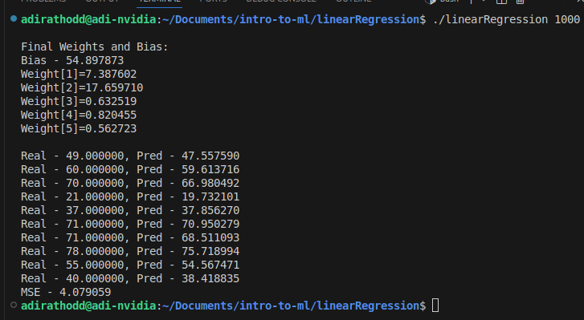

# Linear Regression

This module implements a linear regression model from scratch in C++ and accelerates matrix operations using NVIDIA CUDA. It processes CSV datasets, computes the normal equation for parameter estimation, and predicts continuous outcomes.

## Features

- CSV data loading and preprocessing
- GPU-accelerated matrix computations via CUDA kernels
- Reproducible train/test split with fixed random seed

## Dataset

This module uses the Student Performance dataset from Kaggle: https://www.kaggle.com/datasets/nikhil7280/student-performance-multiple-linear-regression. It contains various student metrics (e.g., study time, past grades, attendance) and corresponding exam scores. Use the provided `student_performance.csv` file in the `data/` directory.

## Results

- Mean Squared Error (MSE) on test set: **4.079**

